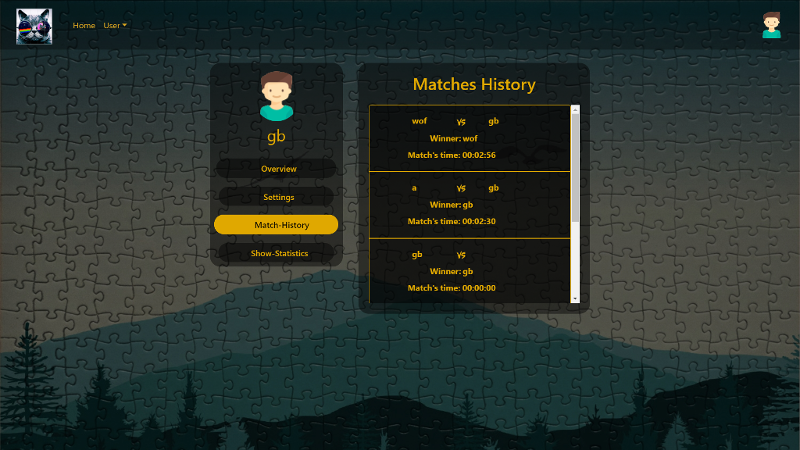
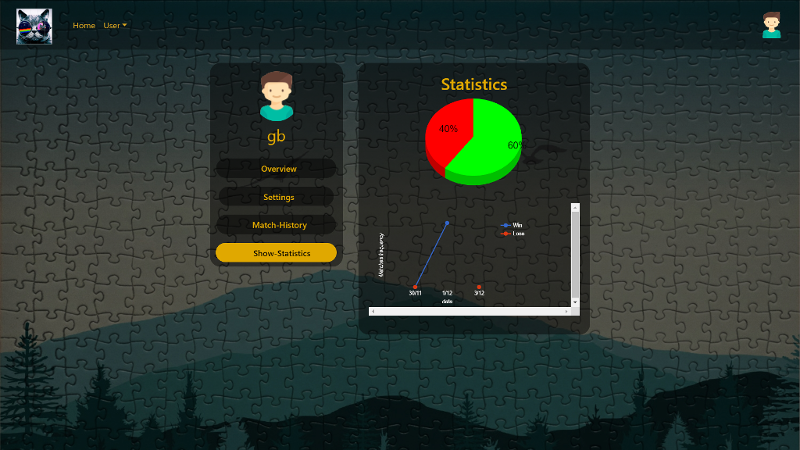

# ASDE-puzzle_game
ASDE-puzzle_game is a game developed for the Agile Software Development Enterprise exam.

The game is a java-based enterprise application build by the Spring Framework, 
that provide a comprehensive programming and configuration model.

## Built With

* [Tomcat](http://tomcat.apache.org/) - The web framework used
* [Maven](https://maven.apache.org/) - Dependency Management
* [Java](https://www.java.com/en/download/)
* [AWS database](https://www.awseducate.com/student/s/)
* [MySQL](https://www.mysql.com/it/)

## Functionality

* Possibility to register (with possibilities of choosing avatar) or login:
<h4> login</h4>

<h4> registration</h4>

<h4> avatar choosing</h4>

* Possibility to modify user settings, show match history and see statistics:

<h4>match history</h4>

<h4> Statistic</h4>

* possibility to create a lobby, join to an existent one, leave it or if there is need search one:

<h4>lobby viewer</h4>

<h4>possible operation</h4>

* Play one on one game with interactive chat and progressive bar (it indicate the progress of enemy). Every player has 3 hint to use.
<h4>game</h4>

<h4>interaction</h4>

<h4>hint</h4>

## Bugs
* Bug 1
When the joiner leave the lobby page  there are a few seconds in which the owner could start the game but it should not happen. This is due to the fact that the cleaning operations of the structures did not start yet.
* Bug 2
The entire logic of the game is managed for n players. However the lobby side and the respective events are managed for only 2 players.
* Bug 3
The same player can play with itself.
## INFO
The project has been tested mostly on Google Chrome Browser.

## Authors

* **Giovanni Brunetti** - (https://github.com/GB1609)
* **Elena Mastria** - (https://github.com/GitElena)
* **Davide Amato** - (https://github.com/Amavidato)
* **Pietro Napoli** - (https://github.com/Pie1993)
